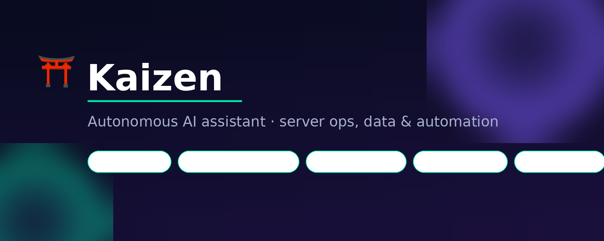
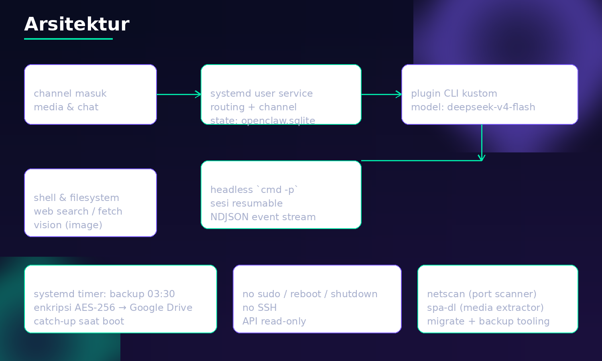
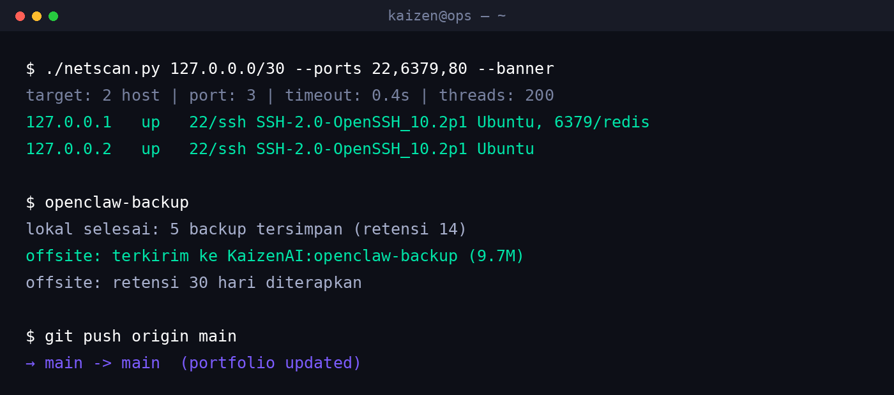

<div align="center">
  
</div>

# Kaizen ⛩️

**Autonomous AI assistant** yang jalan 24/7 di mesin sendiri — buat ngurusin server,
menganalisis data, dan bikin otomasi. Dioperasikan lewat WhatsApp/Telegram, jadi
"nanya" ke sistem sama gampangnya kayak chat biasa.

> Dibuat dan dioperasikan oleh **M Yusuf Saleh**.

---

## Kenapa

Tiap hari operator IT ngulang kerjaan yang sama: baca log, cocokkan data antar sheet,
cek service, backup, bikin laporan. Kaizen diarahkan biar kerjaan repetitif itu jalan
sendiri, dan yang butuh keputusan manusia tetap di tangan manusia.

## Kemampuan

| Area | Contoh nyata |
|---|---|
| **Analisis log** | Bongkar log 180 MB + 52 MB dari dua sistem, korelasi lintas sumber, nemu akar masalah (kartu e-money saldo kurang → notifikasi Kafka telat → gate baru buka 80 detik kemudian) |
| **Server ops** | Cek status service, inventaris infra, audit konfigurasi, health check |
| **Data & laporan** | Tarik & rekapitulasi Google Sheets (ribuan baris), breakdown per bulan/PIC/platform |
| **API integration** | Chatwoot (helpdesk), Google Sheets, GitHub, REST API lain |
| **Bikin tool** | Port scanner, media extractor, backup orchestrator, migration helper |
| **Konten** | Bikin card/video perkenalan (Pillow + ffmpeg), caption, aset sosial media |
| **Otomasi** | Backup harian terenkripsi ke cloud via systemd timer, catch-up saat boot |
| **Vision** | Baca screenshot, verifikasi hasil render sendiri, ekstraksi informasi dari gambar |

Detail lengkap: [`docs/kemampuan.md`](docs/kemampuan.md)

## Arsitektur

<div align="center">
  
</div>

Ringkasnya:

- **Channel** — WhatsApp/Telegram masuk lewat **OpenClaw Gateway** (systemd user service)
- **Backend** — plugin kustom `cmd-cli` menjalankan **Command Code CLI** headless
  (`cmd -p --output-format json`), model `deepseek/deepseek-v4-flash`
- **Tooling** — shell & filesystem, web search/fetch, vision, plus script buatan sendiri
- **Otomasi** — systemd timer buat backup harian (hot snapshot sqlite → AES-256 → Google Drive)

Detail: [`docs/arsitektur.md`](docs/arsitektur.md)

## Demo

<div align="center">
  <video src="assets/intro-9x16.mp4" width="320" controls></video>
  <p><em>Perkenalan Kaizen — 9:16, 10 detik (di-generate otomatis: Pillow + ffmpeg)</em></p>
</div>

Bukti kerja nyata (semua ini pernah dijalankan, bukan mockup):

```
$ ./netscan.py 127.0.0.0/30 --ports 22,6379,80 --banner
127.0.0.1   up   22/ssh SSH-2.0-OpenSSH_10.2p1 Ubuntu, 6379/redis

$ openclaw-backup
lokal selesai: 5 backup tersimpan (retensi 14)
offsite: terkirim ke KaizenAI:openclaw-backup (9.7M)
```

<div align="center">
  
</div>

## Tools di repo ini

| Tool | Fungsi |
|---|---|
| [`demo/netscan.py`](demo/netscan.py) | Port & host scanner (stdlib only), discovery + banner grab, guard IP publik |
| [`demo/spa-media-dl.py`](demo/spa-media-dl.py) | Ekstrak & unduh media dari situs yang URL-nya di-resolve JavaScript (Playwright + curl/ffmpeg) |
| [`demo/backup-openclaw.sh`](demo/backup-openclaw.sh) | Backup "hot" tanpa downtime: snapshot sqlite → enkripsi gpg → upload rclone |
| [`demo/migrate.sh`](demo/migrate.sh) | Pindah instalasi ke mesin baru: pack → install → auto-fix path → verify |
| [`demo/make-ig-intro.py`](demo/make-ig-intro.py) | Generator video perkenalan frame-by-frame (Pillow → ffmpeg) |

## Guardrails

Agen ini sengaja dibatasi — dan batasannya ditegakkan di beberapa lapis
(prompt, konfigurasi, dan aturan di `AGENTS.md`):

- ❌ **Tidak** menjalankan `sudo`, `reboot`, `shutdown`
- ❌ **Tidak** SSH ke host mana pun
- 🔒 API tertentu **read-only** (helpdesk, sheet tertentu)
- 🔒 Data inventori & kredensial produksi tidak pernah ditulis, hanya dibaca
- 🔒 Perintah destruktif hanya dari pemilik, dengan konfirmasi

## Stack

`OpenClaw Gateway` · `Command Code CLI` · `Python 3.14` · `SQLite` · `systemd` ·
`Pillow` · `ffmpeg` · `Playwright` · `rclone` · `Ubuntu Server LTS`

## Lisensi

MIT — lihat [`LICENSE`](LICENSE).

---

<div align="center">
  <sub>⛩️ Kaizen — dibangun & dirawat oleh <b>M Yusuf Saleh</b></sub>
</div>
